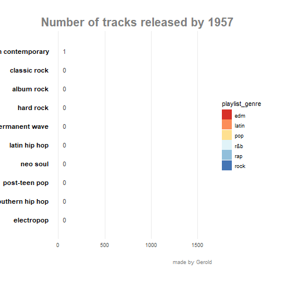

```{r setup, include=FALSE}
knitr::opts_chunk$set(echo = TRUE)
```

```{r libraries, echo=FALSE}
library(data.table)
library(ggplot2)
theme_set(theme_bw()) # set global theme for ggplot
```


```{r read, echo=TRUE, message=FALSE, warning=FALSE}
# Read data
spotify_songs <- readr::read_csv('https://raw.githubusercontent.com/rfordatascience/tidytuesday/master/data/2020/2020-01-21/spotify_songs.csv')

```

```{r skim}
# Check data
dim(spotify_songs)

# Let's convert into data.table for efficiency reasons
spotify_songs <- as.data.table(spotify_songs)

# Skim the data to get some sense of variable attributes
id_cols <- c('track_id', 'track_album_id', 'playlist_id')
skimr::skim(spotify_songs[, setdiff(colnames(spotify_songs), id_cols)])

```


I think it was definitely worth skimming the data, since it provide a nice overview of the data. With that in hand, we are able to phrase relevant/interesting questions about the spotify dataset. I am going to classify these questions into two groups:  

### 1. Data quality: 
  + What is the **granularity** of the data? I would have first guessed that it is a track but you can
see in the skim output that it doesn't equal the number of rows. We better look into this!  
  + There are some extremely long track/album/playlist names. Why is that?  
  + There are a very little missing data but I am going to check whether they can be imputed or just dropped.  
  + The distribution of the numeric variables seem oaky at first glance, so I will leave them as they are for the time being.  

### 2. Data exploration: what insights can we infer from the data? I am rather interested in two main topics.
  + How are genres and subgenres related to each other?
  + What are the most popular songs/albums?
  + Can we cluster the songs so they will be belong to the same genre? In other words, can we validate the way we group data by genre by data?  
  + I wanna see how the number of tracks in each genre increased over time.
  
Enough is said, let's get to work!

### Data quality

```{r data_quality}
# First check missing data
spotify_songs[is.na(track_name) ]
```

It seems like we have all the data except for attributes of the artist. This isn't really surprise because spotify_songs data.table seems to come from a transactional database and thus only the manually adminstered data such as artist name etc.. can be missing. Let's drop these observations

```{r data_quality2}
spotify_songs <- na.omit(spotify_songs)
data_dim <- dim(spotify_songs)
```

To check upon the granularity of the dataset, look for songs that are present more than once

```{r granularity}
# First check whether the rows are unique but I suspect it isn't the cause
dim(unique(spotify_songs)) # not it isnt't

# check song counts
dups <- spotify_songs[, .(song_cnt = .N), by = track_id][song_cnt > 1][order(-song_cnt)]
dups
dups_sum <- sum(dups$song_cnt)

# check the one with the most presence
spotify_songs[track_id == '7BKLCZ1jbUBVqRi2FVlTVw'][
  ,c('track_name', 'track_artist', 'track_album_name', 'playlist_name', 'playlist_id')]
```

It seems like that  a track being present in more playlists is causing this. If this is the case, then track_id and playlist_id together should be the granularity of the data. Let's prove this:

```{r granularity2}
# which equals
dim(dups)[1] - dups_sum
```

This equals number of records - distinct track ids. This was important to check because we can be quite sure that not the song changed but it was just included in more playlists. We will need to keep this in mind when analyzing the song attributes to not to include the same song multiple times! 
Next up is to inspect album name lengths.

```{r length}
# create var
spotify_songs[, album_name_length := nchar(track_album_name)]

# viz length distribution
ggplot(spotify_songs, aes(album_name_length)) + 
  geom_histogram(colour="darkblue", fill="lightblue") +
  geom_vline(aes(xintercept=mean(album_name_length)),
    color="purple", linetype="dashed", size=1) + 
    labs(title = "ALbum name char. length distribution") +
    theme(plot.title = element_text(hjust = 0.5))

# check what can you make out of 50 chars    
spotify_songs[album_name_length == 50][1:2,track_album_name]

# check what can you make out of 70 chars    
spotify_songs[album_name_length == 70][1:2, track_album_name]

# check what can you make out of 50 chars    
spotify_songs[album_name_length == 90][1:2, track_album_name]

# check what can you make out of 50 chars    
spotify_songs[album_name_length == 110][, track_album_name]

```

Well, these seem to reasonable names. But what about playlists? They should have rather short and not too specific names. Let's do the same for playlists.

```{r length2}
# create var
spotify_songs[, playlist_name_length := nchar(playlist_name)]

# viz length distribution
ggplot(spotify_songs, aes(playlist_name_length)) + 
  geom_histogram(colour="darkblue", fill="lightblue") +
  geom_vline(aes(xintercept=mean(album_name_length)),
    color="purple", linetype="dashed", size=1) + 
    labs(title = "Playlist name char. number distribution") +
    theme(plot.title = element_text(hjust = 0.5))

# check what can you make out of 50 chars    
spotify_songs[playlist_name_length > 50][1, playlist_name]

# check what can you make out of 70 chars    
spotify_songs[playlist_name_length > 100][1, unique(playlist_name)]
```

`U0001f47d` are emoji encodings, so if we want to really analyze playlist name lengths, then we should filter these out. It could be done by R's base `enc2native()` but I will just leave it this way because I just wanted to see name with long lenghts. 

### EDA

Check how subgenres relate to genres
```{r genres}
spotify_songs[, unique(playlist_subgenre), by=playlist_genre]
```

From now on, the song attributes such as tempo, loudness etc.. will be analyzed. Since songs are duplicated, let's filter for unique songs.

```{r filter_to_first}

songs <- unique(spotify_songs, by = 'track_id')
dim(songs)
```

Which artists/albums are the most popular? Filter for more than 20 tracks.

```{r popularity}
# plot an artist ranking
# horizontal
ggplot(songs[, .(avg_popularity = mean(track_popularity),
          pop_sd = sd(track_popularity),
          track_count = .N
          ) , by = track_artist][track_count > 20][order(-avg_popularity)][1:10,]
) +
  geom_bar( aes(x=reorder(track_artist, avg_popularity), y=avg_popularity), stat="identity", fill="skyblue", alpha=0.5) +
  geom_errorbar( aes(x=track_artist, 
                     ymin=avg_popularity-pop_sd, 
                     ymax=avg_popularity+pop_sd), width=0.4, colour="orange", alpha=0.9, size=1.3) +
  coord_flip() +
  labs(title = 'Top 10 artists', x = 'artists')
```

The sd range is big due to the small number of observations. Do the same for albums. Here I think gotta be more cautios because I suspect album names to be not unique for different aritsts.

```{r }
# get best albums by popularity only consider albums w. at least 5 tracks
fav_albums <- songs[, .(avg_popularity = mean(track_popularity),
          pop_sd = sd(track_popularity),
          track_count = .N
          ) , by = track_album_id][order(-avg_popularity)][track_count > 5][1:10,]

# merge to get artist names
fav_albums <- merge(fav_albums, 
      unique(songs, by = c('track_album_id', 'track_album_name', 'track_artist'))
      [, c('track_album_id', 'track_album_name', 'track_artist')], 
      all.x =T, all.y = F, by = 'track_album_id')

# create var to display album name + performer
fav_albums[, artist_album:= do.call(paste, c(.SD, sep = " - ")), 
           .SDcols=c('track_artist', 'track_album_name')] 

ggplot(fav_albums) +
  geom_bar( aes(x=reorder(artist_album, avg_popularity), y=avg_popularity), stat="identity",
            fill="skyblue", alpha=0.5) +
  coord_flip() +
  labs(title = 'Top 10 artists', x = 'artists')

```

I am really interested whether the playlist genres really group the alike songs. I consider alike songs that have their attributes like energy and loudness in a similar range. To do this, let's apply PCA and cluster the songs and then check whether the clusters capture the genres.

```{r clusters}
library(caret)
library(NbClust)
library(factoextra)

pca_vars <- colnames(songs) 
# extract numeric vars
pca_vars <- pca_vars[!(startsWith(pca_vars, 'track') |  startsWith(pca_vars, 'playlist') |
                       startsWith(pca_vars, 'album'))]

pca_result <- prcomp(songs[, pca_vars, with=F], scale. = T)
(pca_result$rotation)[, seq(1:5)]

fviz_pca(pca_result, label = F, alpha = 0.2)

```

Well there is a lot of overlap. Lets color the songs (dots) by genre, we might explore patterns

```{r clsuters2}
# create a data table from the pca result
pca_songs <- as.data.table(pca_result$x)
# assign rows as ids
pca_songs[, id:=row.names(pca_songs)]
# do the same for the `original` dataset
songs[, id:=row.names(songs)]


ggplot(merge(pca_songs, songs[, c('id', 'playlist_genre')], 
      all.x = T, all.y = T, by = 'id'), 
      aes(PC1, PC2, color = playlist_genre)) +
  geom_point(alpha = 0.2)

```

Well, there is a lot of data points and a lot of overlap. If I may try hard enough, I may find some patterns between the genres but just by looking at this graph, it is nearly impossible. We would be better of if we analyzed this problem analytically, for example clustering in this PCA space and calculate for example dissimilarity scores between the clusters. But that would be out of the scope of this assignment.

Let's make racing bars based on how many songs were made per year per subgenre. 
This page was really helpful when doings this: [link](https://www.r-bloggers.com/how-to-create-a-bar-chart-race-in-r-mapping-united-states-city-population-1790-2010/)

```{r racing}
# create a Year col
songs[, Y := format(as.Date(track_album_release_date), "%Y") ]
# select relevant cols
data_racing <- songs[, c('Y', 'playlist_subgenre', 'track_id')]
data_racing <- na.omit(data_racing)  # needed for the ggplot

data_racing <- data_racing[, .(cnt = .N), by = c('Y', 'playlist_subgenre' ) ]
setorderv(data_racing, c('Y', 'cnt'))
# cumulative count
data_racing[, cnt_cum := cumsum(cnt), by = c( 'playlist_subgenre')]
# not necessary col
data_racing[,cnt:=NULL]

data_racing[order(c('YM', 'playlist_subgenre'))]
# check if this works as expected
data_racing[playlist_subgenre == 'album rock'][1:8]

```

I really prefer pivoting data.frames and not data.tables
```{r libraries_again, echo=TRUE, message=FALSE, warning=FALSE}
library(tidyr)
library(tidyverse)
```

```{r racing2}
# only to get the 'full' range of year for example there are years for which there was no tracks released in a genre
data_racing <- pivot_wider(data_racing, names_from = Y, values_from = cnt_cum )
data_racing <- pivot_longer(data_racing, -playlist_subgenre, names_to = "Y", values_to = "album_cumsum")

# forward fill values. If there was no track in 1970 in a genre then it will be imputed with the last value
data_racing <- data_racing %>% 
  group_by(playlist_subgenre) %>% 
  fill(album_cumsum)

# shape for ggplot
data_racing <- data_racing %>% 
  group_by(Y) %>% 
  arrange(-album_cumsum) %>% 
  mutate(rank = row_number()) %>% 
  filter( rank <= 10) %>% 
  arrange(Y)

```

```{r}
library(gganimate)
gen_subgenre <- unique(songs[, c('playlist_genre', 'playlist_subgenre')])
data_racing <- merge(data_racing, gen_subgenre, by = 'playlist_subgenre', all.x = T, all.y = F)
data_racing$Y <- as.numeric(data_racing$Y)
# write_rds(racing_rds, 'racing.rds')

p <- data_racing %>%
  ggplot(aes(x=-rank, y=album_cumsum, fill = playlist_genre)) +
  geom_tile(aes(y = album_cumsum/2, height=album_cumsum),width=0.9)+
  geom_text(aes(label=playlist_subgenre),
            hjust="right",
            colour="black",
            fontface="bold",
            nudge_y=-100)+
  geom_text(aes(label=scales::comma(album_cumsum)),
            hjust="left",
            nudge_y=50,
            colour="grey30")+
  theme_minimal() +
  coord_flip(clip="off") +
  scale_x_discrete("") +
  scale_y_continuous("",labels=scales::comma)+
  scale_fill_brewer(palette = 'RdYlBu') +
  theme(panel.grid.major.y=element_blank(),
        panel.grid.minor.x=element_blank(),
        plot.title= element_text(size=20,colour="grey50",face="bold"),
        plot.caption = element_text(colour="grey50"),
        plot.subtitle = element_text(size=20,colour="grey50",face="bold"),
        plot.margin = margin(1,1,1,2,"cm"),
        axis.text.y=element_blank())+
  transition_time(Y) +
  labs(title='Number of tracks released in {round(frame_time,0)}',
       caption='made by Gerold')

# I couldn't make this work so in an rmdown so I animated and saved the gif in an R script
# rendering a video would help solving this but would have taken too much time to deal with this
#animate(p, duration = 30, fps = 25, end_pause = 20) 
# anim_save("racing-bars.gif")

```



